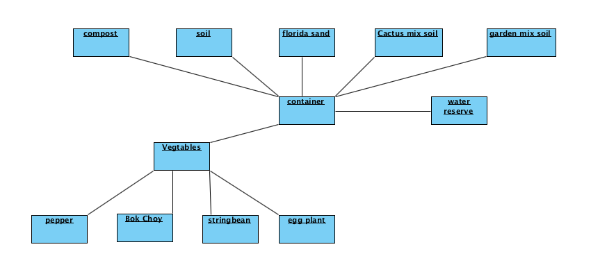

## **P**ortable **O**rganic **T**rouble-free **S**elf-watering System (**POTS**) Model

(Remove: decribe the model here, use whatever diagram you need object, class, etc)

By looking at the object Diagram this system is connected via two main componets the vegtables and container. The container, is home to a variety of sources, and there is variety in the vegatables. Through the cycles, the volume will be calculated for each componet to determine the amount of water that the plants need, to then subtract the water taken out of the reserve. 

Below the Class Diagrams can be seen for four classes.Each have their respective variables along with their own functions. Some variables are used over, which makes sense as the POTS system is relaying the information to gather all of the data. 

