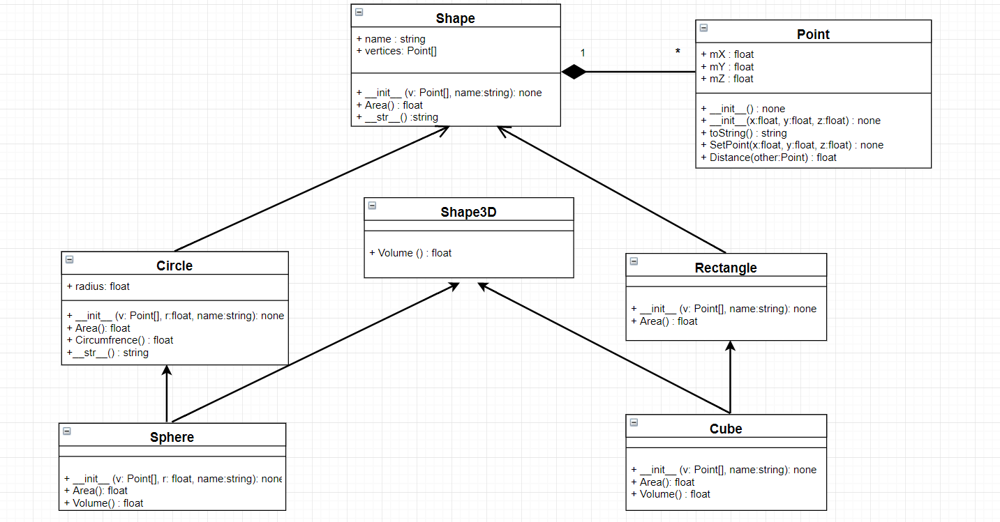

## **P**ortable **O**rganic **T**rouble-free **S**elf-watering System (**POTS**) Model

(Remove: decribe the model here, use whatever diagram you need object, class, etc)

(Remove: The code does run - you should try it. It does not do much, but has a very basic 
simulation loop in it and key press to take a look at.)

(Remove: You kill your plants after a key timesteps, but you could always add nuterients
from compost and add more water and tweak it based on measured constants to simulate
a real system)

Example linked diagram to help you.

more decription