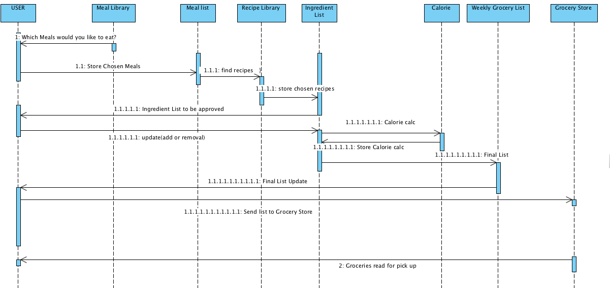

## Smart City Automated Grocery List Model - Object Diagram

**DESCRIPTION**
The model below describes the sequence in order to produce the Grocery List.
Initially the user is prompted which meals they would like to choose from the 'Meal Library'. The input is then stored into the 'Meal list', and compared to 'Recipe Library' which has the 'Ingredients List' for each of the indiviual meals. The Calorie Count is also calculated dependant on the Recipe and store in the Ingredient List for each of the respective ingredients. The 'Ingredient List' is then stored to the final list: 'Weekly Grocery List' and sent back to the user. The user then is able to send to grocery store, and alerted for pick up. The user also can also go shop themselves additionally instead of sending the list to the store.

