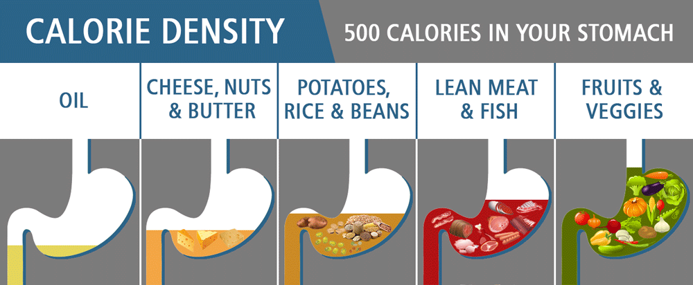

## Smart City Automated Grocery List Model - Object Diagram

**DESCRIPTION**
This model below describes the process of my proposed system. The system will have a library of Meals to choose from for the user.With the meals chosen, the meal library will go through the recipe library to determine which ingredients and how much is to be used. After storing the respective ingredients and their quantities the calorie count, and the grocery list is generated. Lastly a weekly summaries is available for monitoring of progress of the user and what they consume in terms of calories. The list also is available to send the list to the users local grocery store for pick-up or delivery(depending on the store).

**REASONING**
In the city life, alot of people often have to commute or are busy with job, school, etc. Addtionally when it comes to eating most people are forced to get something quick and convientent, but ulitmately lack healthy options. One way to solve this is eating at home and cooking your own food. Of course with this being said, figuring out what youre going to eat and making the grocery list can be a very time consuming process. Addtionally being aware of ones calorie count will empower users to make informed decision about their diet with out having to spend hours per week figuring it out. 

Troubleshooting
https://guides.github.com/features/mastering-markdown/

Picture Sources: 
http://www.physioanswers.com/2016/09/calorie-density-how-to-lose-weight.html
https://leaf.nutrisystem.com/how-to-cut-your-time-at-the-grocery-store-in-half/